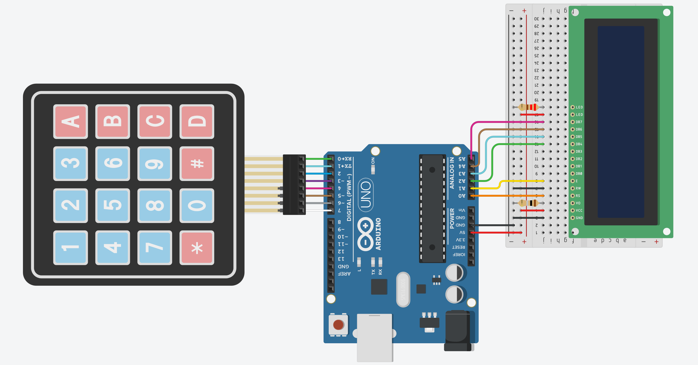

# Calculadora

O objetivo desse projeto é simular uma calculadora simples utilizando monitor **LCD** e **teclado 4x4**.


## Componentes necessários

|    Componente   | Quantidade |
|:---------------:|:----------:|
|   Arduino UNO   |      1     |
| Placa de ensaio |      1     |
|   Teclado 4x4   |      1     |
|    LCD 16x2     |      1     |
|  Resistor 1 ohm |      1     |
|Resistor 220 ohms|      1     |
|      Jumper     |     20     |

*A quantidade de jumpers necessários pode variar de acordo com a forma de montagem.*

## Esquema de montagem



| Componente | Porta do componente |  Porta do Arduino  | Resistor |
|:----------:|:-------------------:|:------------------:|:--------:|
|Teclado 4x4 |       coluna 4      |          0         |          |
|            |       coluna 3      |          1         |          |
|            |       coluna 2      |          2         |          |
|            |       coluna 1      |          3         |          |
|            |       linha 4       |          4         |          |
|            |       linha 3       |          5         |          |
|            |       linha 2       |          6         |          |
|            |       linha 1       |          7         |          |
|  LCD 16x2  |         GND         |          -         |          |
|            |         VCC         |         5v         |          |
|            |         V0          |          -         |  1 ohm   |
|            |         RS          |         A0         |          |
|            |         RW          |          -         |          |
|            |          E          |         A1         |          |
|            |         DB4         |         A2         |          |
|            |         DB5         |         A3         |          |
|            |         DB6         |         A4         |          |
|            |         DB7         |         A5         |          |
|            |      LED anodo      |          +         |          |
|            |     LED catódico    |          -         | 220 ohms |

## Código em Scratch

*Não foi utilizado*

## Dependências

```C
#include <LiquidCrystal.h> // Usada para controlar LCDs
#include <Keypad.h> // Usada para controlar botões em forma de matriz
```

As documentações podem ser encontradas em [LiquidCrystal.h](https://www.arduino.cc/en/Reference/LiquidCrystal "arduino.cc/en/Reference/LiquidCrystal") e [Keypad.h](https://www.arduino.cc/reference/en/libraries/keypad/ "arduino.cc/reference/en/libraries/keypad/")
