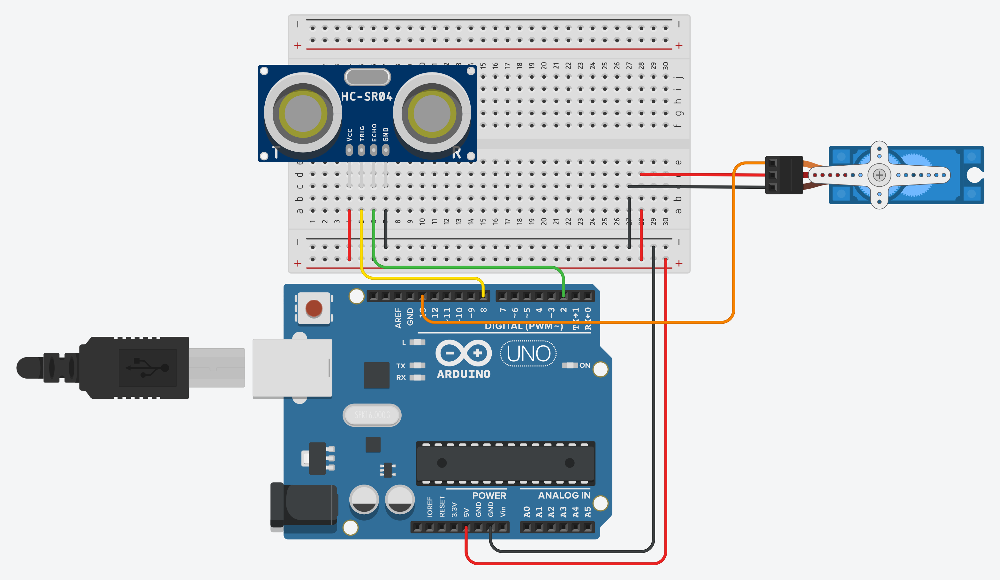

# Projeto da Cancela

O objetivo desse projeto é simular uma cancela de automóveis.
Quando um objeto se aproxima do sensor ultrasônico **HC-SR04** o
micro servo motor **SG90** deve fazer um ângulo de 90 graus simulando
a passagem do automóvel. 

## Componentes necessários

|    Componente   | Quantidade |
|:---------------:|:----------:|
|   Arduino UNO   |      1     |
| Placa de ensaio |      1     |
|     HC-SR04     |      1     |
|       SG90      |      1     |
|      Jumper     |     11     |

*A quantidade de jumpers necessários pode variar de acordo com a forma de montagem.*

## Esquema de montagem

| Componente | Porta do componente | Porta do Arduino | Resistor |
|:----------:|:-------------------:|:----------------:|:--------:|
|   HC-SR04  |       Trigger       |         8        |          |
|            |         Echo        |         2        |          |
|            |         VCC         |        5V        |          |
|            |         GND         |        GND       |          |
|    SG90    |     Programação     |        13        |          |
|            |          +          |        5V        |          |
|            |          -          |        GND       |          |

## Código em Scratch

## Dependências

~~~C++
#include <Servo.h>   // Para o funcionamento do servo motor SG90  
~~~

Documentação da biblioteca [servo.h](https://www.arduino.cc/reference/en/libraries/servo/).