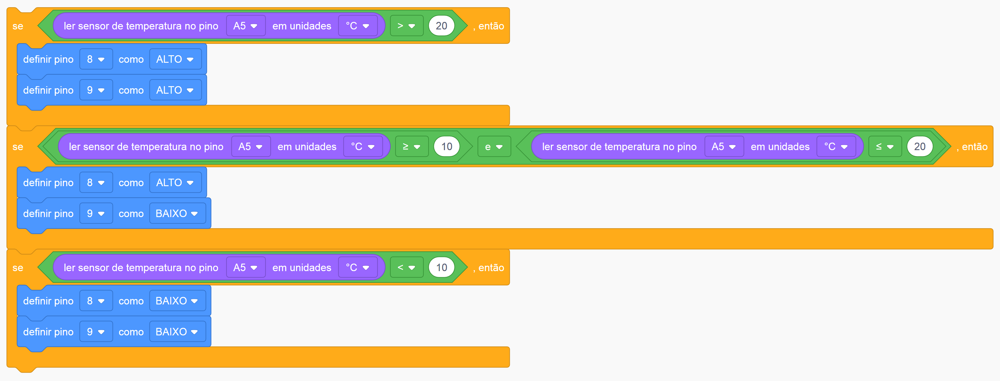

# Projeto da Estufa

O objetivo desse projeto é simular uma estufa com 2 leds, cada um representando uma tela da estufa (led ligado = tela aberta). As telas devem estar abertas se a temperatura na estufa for maior que 20ºC, uma deve aberta caso a temperatura esteja entre 10 e 20ºC e ambas devem estar fechadas caso a temperatura seja menor que 10ºC. 

## Montagem 

Os tópicos a seguir estão relacionados ao processo de montagem do projeto.

### Materiais necessários

|    Componente   | Quantidade |
|:---------------:|:----------:|
|   Arduino UNO   |      1     |
| Placa de ensaio |      1     |
|      TMP36      |      1     |
|Resistor 220 ohms|      2     |
|       LED       |      2     |
|      Jumper     |      9     |

A quantidade de jumpers necessários pode variar de acordo com a forma de montagem.

### Esquema de montagem

| Componente | Porta do componente | Porta do Arduino |
|:----------:|:-------------------:|:----------------:|
|    TMP36   |         Vout        |        A5        |
|            |         VCC         |        5V        |
|            |         GND         |        GND       |
|LED Vermelho|          +          |         8        |
|            |          -          |        GND       |
| LED Verde  |          +          |         9        |
|            |          -          |        GND       |

## Código 

Os tópicos a seguir estão relacionados ao código do projeto.

### Código em Scratch

### Dependências

Não foram usadas bibliotecas nesse projeto.