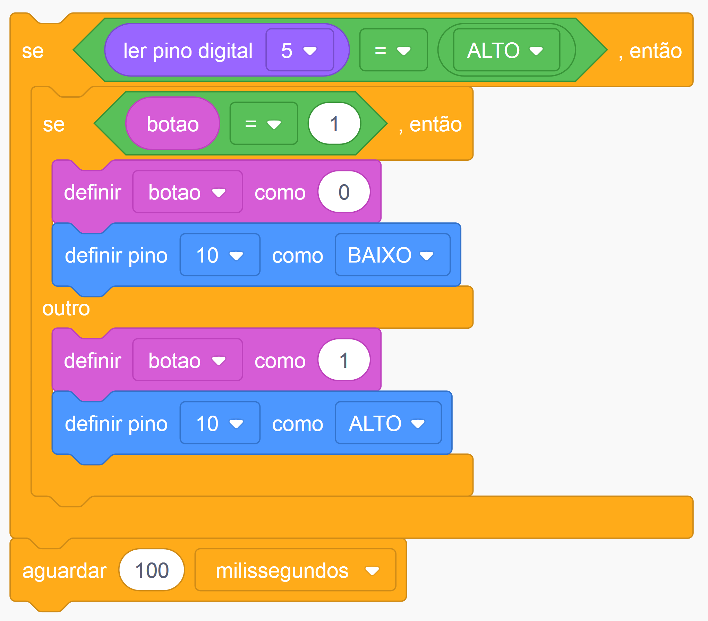

# Interruptor

O objetivo desse projeto é simular um interruptor de luz. Quando o botão é ativado o led deve acender. 

## Montagem 

Os tópicos a seguir estão relacionados ao processo de montagem do projeto.

### Materiais necessários

|    Componente      | Quantidade |
|:------------------:|:----------:|
|     Arduino UNO    |      1     |
|   Placa de ensaio  |      1     |
|       Botão        |      1     |
|        LED         |      1     |
|       Jumper       |      6     |
|  Resistor 220 ohms |      6     |

A quantidade de jumpers necessários pode variar de acordo com a forma de montagem.

### Esquema de montagem

| Componente | Porta do componente | Porta do Arduino |
|:----------:|:-------------------:|:----------------:|
|    Botão   |     Terminal 1a     |        5V        |
|            |     Terminal 2a     |         5        |
|     LED    |          +          |        10        |
|            |          -          |       GND        |

## Código 

Os tópicos a seguir estão relacionados ao código do projeto.

### Código em Scratch

### Dependências

Não foram usadas bibliotecas nesse projeto.