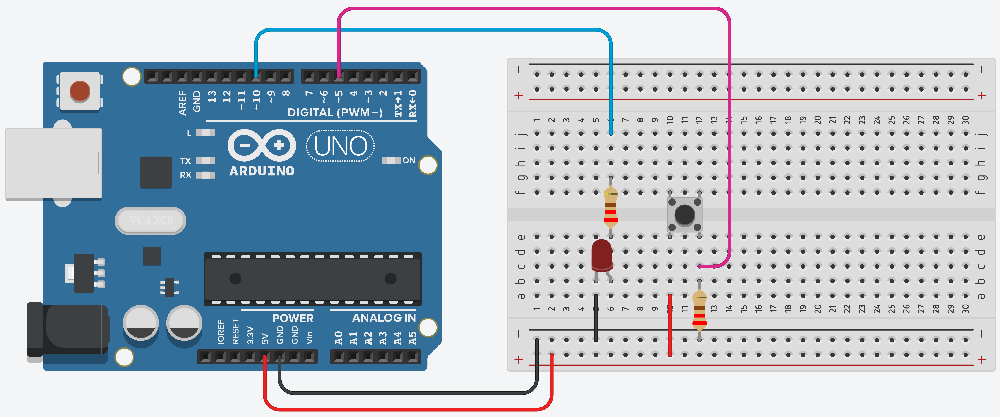

# Interruptor

O objetivo desse projeto é simular um interruptor de luz. Quando o **botão** é ativado o **led** deve acender. 

## Componentes necessários

|    Componente      | Quantidade |
|:------------------:|:----------:|
|     Arduino UNO    |      1     |
|   Placa de ensaio  |      1     |
|       Botão        |      1     |
|        LED         |      1     |
|       Jumper       |      6     |
|  Resistor 220 ohms |      2     |

*A quantidade de jumpers necessários pode variar de acordo com a forma de montagem.*

## Esquema de montagem

| Componente | Porta do componente | Porta do Arduino | Resistor |
|:----------:|:-------------------:|:----------------:|:--------:|
|    Botão   |     Terminal 1a     |        5V        |          |
|            |     Terminal 2a     |         5        | 220 ohms |
|     LED    |          +          |        10        | 220 ohms |
|            |          -          |       GND        |          |

## Código em Scratch

## Dependências

*Não não há dependências neste projeto.*