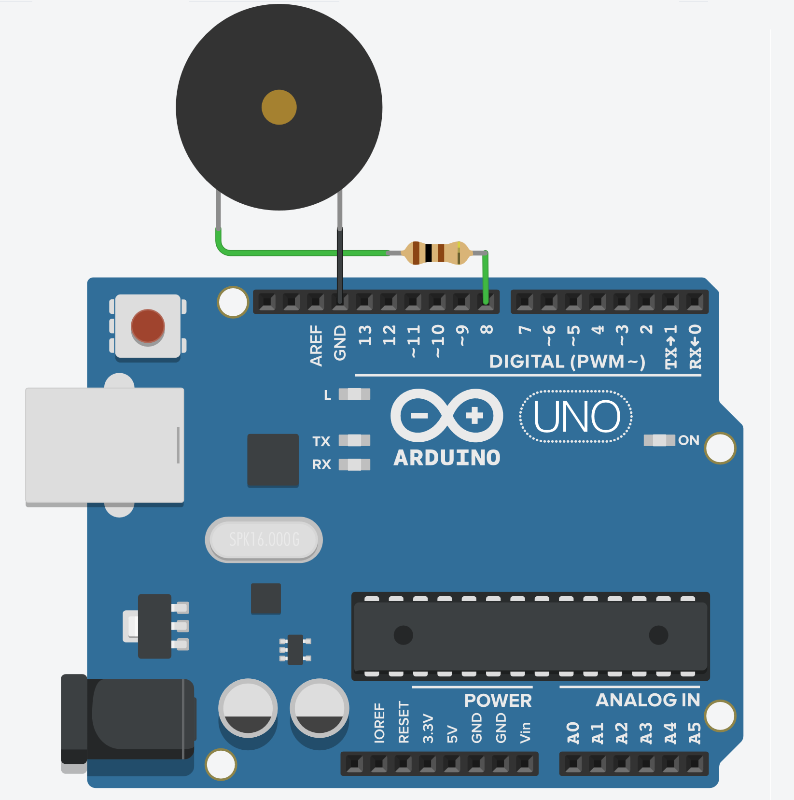

# Projeto das músicas

O objetivo desse projeto tocar varias música utilizando apenas um Buzzer.

Músicas:

* ["Do Fundo da Grota" - Baitaca](https://youtu.be/EtTbS-KdcrE)

* [O tema de Game of thrones](https://youtu.be/TZE9gVF1QbA)

* O tema de Super Mario

*Além disso as notas estão catalogadas caso queira fazer sua própria música*

## Montagem 

Os tópicos a seguir estão relacionados ao processo de montagem do projeto.

### Materiais necessários

|    Componente   | Quantidade |
|:---------------:|:----------:|
|   Arduino UNO   |      1     |
|      Buzzer     |      1     |
|Resistor 100 ohms|      1     |
|      Jumper     |      2     |

A quantidade de jumpers necessários pode variar de acordo com a forma de montagem.

### Esquema de montagem

| Componente | Porta do componente | Porta do Arduino |
|:----------:|:-------------------:|:----------------:|
|   Buzzer   |          +          |         8        |
|            |          -          |        GND       |

## Código 

Os tópicos a seguir estão relacionados ao código do projeto.

### Código em Scratch

*Não foi utilizado*

### Dependências

Não foram usadas bibliotecas nesse projeto.
