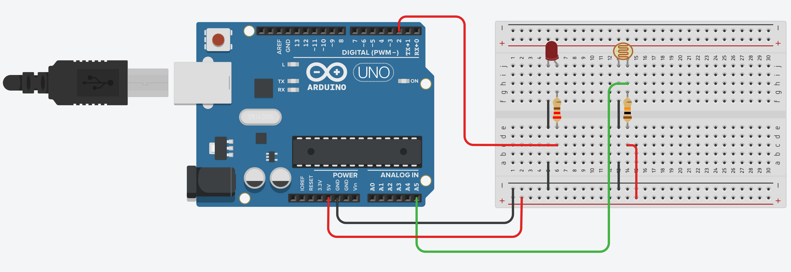
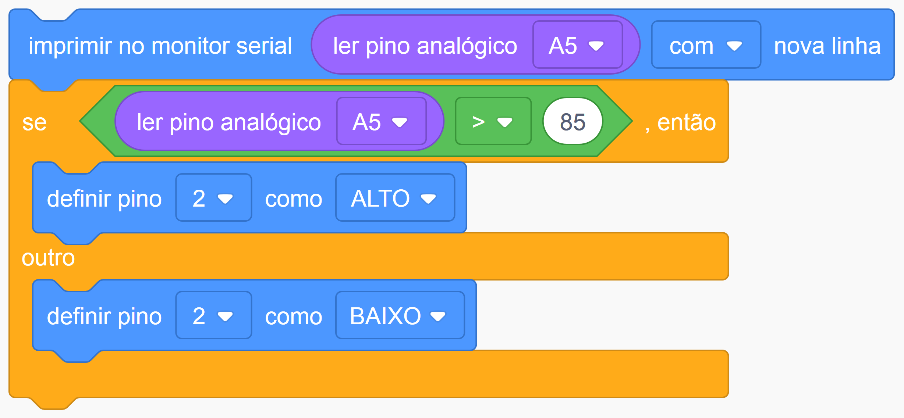

# Projeto do Poste

O objetivo desse projeto é simular um poste de iluminação pública. A lâmpada de led deve acender quando a luminosidade no ambiente for menor que 50%.

## Montagem 

Os tópicos a seguir estão relacionados ao processo de montagem do projeto.

### Materiais necessários

|    Componente   | Quantidade |
|:---------------:|:----------:|
|   Arduino UNO   |      1     |
| Placa de ensaio |      1     |
|       LDR       |      1     |
|Resistor 220 ohms|      1     |
|Resistor 10k ohms|      1     |
|       LED       |      1     |
|      Jumper     |      9     |

A quantidade de jumpers necessários pode variar de acordo com a forma de montagem.

*O resistor de 220 ohms deve ser usado no led enquanto o resistor de 10k ohms deve ser usado no LDR.*

### Esquema de montagem

| Componente | Porta do componente | Porta do Arduino |
|:----------:|:-------------------:|:----------------:|
|    LDR     |      Terminal 1     |        GND       |
|            |      Terminal 2     |       5V, A5     |
|            |         GND         |        GND       |
|    LED     |          +          |         2        |
|            |          -          |        GND       |

## Código 

Os tópicos a seguir estão relacionados ao código do projeto.

### Código em Scratch

*A luminosidade deve ser mostrada no monitor serial durante a execução, procure ativar o led em torno de 50% da capacidade máxima.*

### Dependências

Não foram usadas bibliotecas nesse projeto.