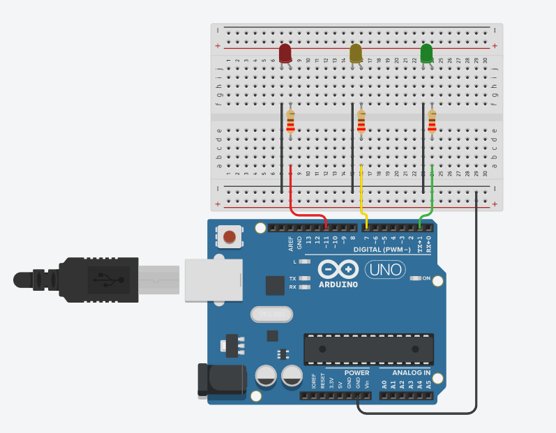
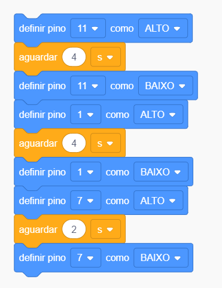

# Semáforo

O objetivo desse projeto é simular um semáforo.

## Montagem 

Os tópicos a seguir estão relacionados ao processo de montagem do projeto.

### Materiais necessários

|    Componente      | Quantidade |
|:------------------:|:----------:|
|     Arduino UNO    |      1     |
|   Placa de ensaio  |      1     |
|        LED         |      3     |
|  Resistor 220 ohms |      3     |
|      Jumpers       |      7     |

A quantidade de jumpers necessários pode variar de acordo com a forma de montagem.

### Esquema de montagem

| Componente | Porta do componente | Porta do Arduino |
|:----------:|:-------------------:|:----------------:|
|LED Vermelho|          +          |        11        |
|            |          -          |       GND        |
|LED Amarelo |          +          |         7        |
|            |          -          |       GND        |
| LED Verde  |          +          |         1        |
|            |          -          |       GND        |

## Código 

Os tópicos a seguir estão relacionados ao código do projeto.

### Código em Scratch

### Dependências

Não foram usadas bibliotecas nesse projeto.