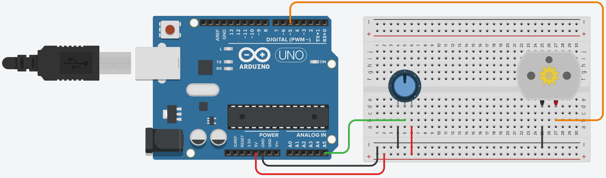

# Ventilador

O objetivo deste projeto é simular um ventilador de teto. O motor deve rodar de acordo com a porcentagem do potenciômetro.

## Componentes necessários

|    Componente   | Quantidade |
|:---------------:|:----------:|
|   Arduino UNO   |      1     |
| Placa de ensaio |      1     |
|  Potenciômetro  |      1     |
|    Motor CC     |      1     |
|      Jumper     |      7     |

*A quantidade de jumpers necessários pode variar de acordo com a forma de montagem.*

## Esquema de montagem

| Componente  | Porta do componente | Porta do Arduino | Resistor |
|:----------: |:-------------------:|:----------------:|:--------:|
|  Motor CC   |      Terminal 1     |        GND       |          |
|             |      Terminal 2     |         5        |          |
|potenciômetro|      Terminal 1     |        GND       |          |
|             |      Terminal 2     |        5V        |          |
|             |       Limpador      |        A5        |          |

## Código em Scratch

## Dependências

*Não há dependências neste projeto.*